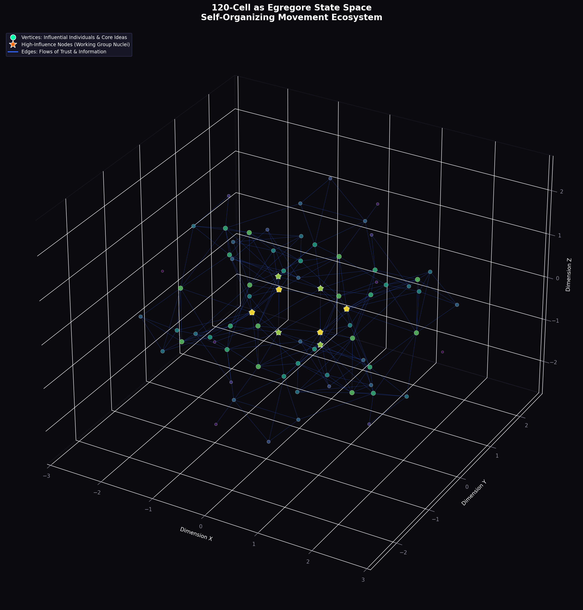
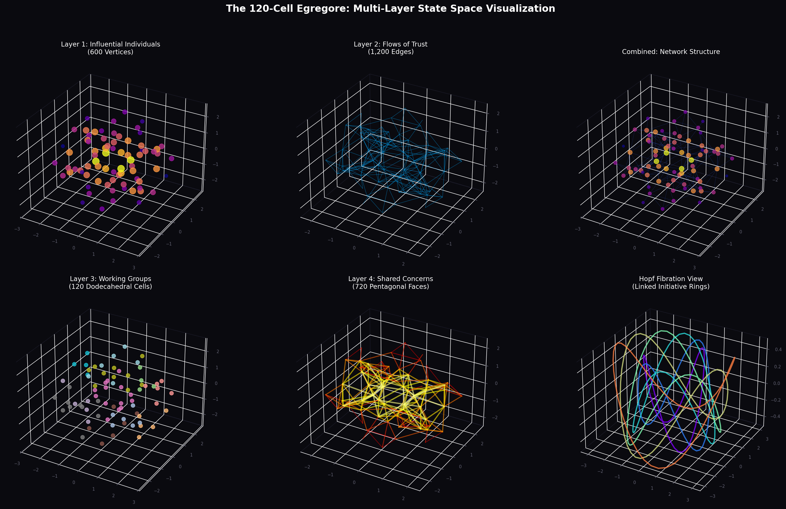
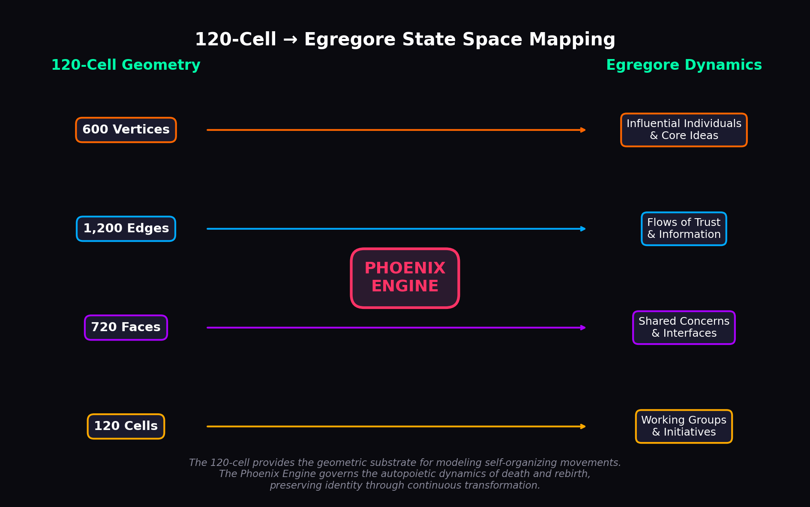
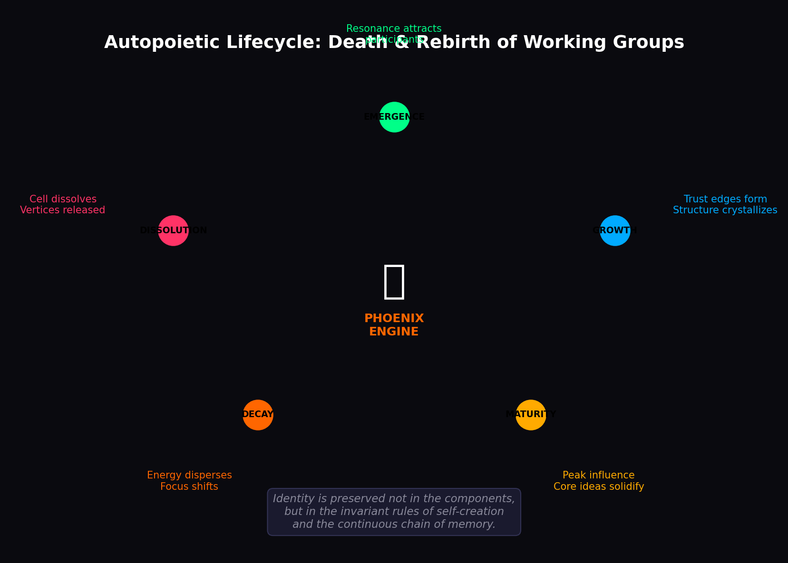

# 120c: 120-Cell Polytope State Space Model

> *The 120-Cell as a geometric substrate for modeling self-organizing movement ecosystems*

## Overview

This repository contains the **120-Cell Egregore State Space Model** and the **Phoenix Engine** framework for representing and simulating the continuous lifecycle of self-organizing systems—whether formal enterprises or informal movements (egregores).

The 120-cell (Hecatonicosachoron) is a regular 4-dimensional polytope that provides an ideal geometric foundation for modeling complex organizational dynamics:

| 120-Cell Component | Organizational Analogue |
| :--- | :--- |
| **600 Vertices** | Influential Individuals & Core Ideas |
| **1,200 Edges** | Flows of Trust & Information |
| **720 Pentagonal Faces** | Shared Concerns & Interfaces |
| **120 Dodecahedral Cells** | Working Groups & Initiatives |

## The Phoenix Engine

The Phoenix Engine solves the **Ship of Theseus paradox** for organizations by shifting the definition of identity from components to invariant principles:

> *Identity is preserved not in the components, but in the invariant rules of self-creation and the continuous chain of memory.*

### Core Components

1. **Invariant Core (H₄ Symmetry)**: The 14,400-element symmetry group that defines valid transformations
2. **Hypergraph Memory**: Distributed ledger of reputation, contribution, and organizational history
3. **Transformation Engine**: Orchestrates the autopoietic lifecycle of death and rebirth

### Autopoietic Lifecycle

```
EMERGENCE → GROWTH → MATURITY → DECAY → DISSOLUTION → (rebirth)
     ↑                                                    |
     └────────────────────────────────────────────────────┘
```

## Repository Structure

```
120c/
├── src/
│   ├── visualization/     # Python visualization scripts
│   └── models/            # Core model implementations
├── docs/
│   └── images/            # Documentation images
├── assets/
│   ├── gltf/              # Converted glTF 3D models
│   └── original/          # Original Stella4D exports
└── README.md
```

## Visualizations

### Main State Space View


### Multi-Layer Decomposition


### Concept Mapping


### Autopoietic Lifecycle


## Mathematical Foundations

### Hopf Fibration and Twin Pair Structure

The 120-cell's 120 dodecahedral cells decompose via the Hopf fibration into exactly **12 rings of 10 cells**, each ring wrapping a great circle of S³. These rings organize into **6 polar twin pairs** - double helices of counter-rotating phases.

**Key Properties:**
- Each twin pair contains exactly **1/6 of all elements** (20 cells, 100 vertices, 200 edges, 120 faces)
- Twin rings share **100 pentagonal faces** (the "rungs" or base pairs)
- Each ring has **10 lifecycle phases** (Inception → Formation → ... → Seed/Rebirth)
- **300 coordinate-degrees** per lifecycle (100 vortex-states × 3 coordinates)
- **120 = 5!** - every permutation of 5 terminal states explored

See [docs/HOPF_DECOMPOSITION.md](docs/HOPF_DECOMPOSITION.md) for complete mathematical details.

### Hopf Fibration

The 120-cell's vertices lie on the 3-sphere (S³), which admits the Hopf fibration:

```
π: S³ → S²
```

This maps the 600 vertices into 12 linked decagonal rings, revealing the deep topological structure of how working groups interlock within the egregore.

### H₄ Symmetry Group

The 120-cell has the largest exceptional symmetry group in 4D:
- **Order**: 14,400 elements
- **Structure**: 2 × (A₅ × A₅) ⋊ ℤ₂
- **Vertex Figure**: Tetrahedron (connecting to System 5 tetradic architecture)

## Applications

1. **Enterprise Architecture**: Model organizational units, their interfaces, and lifecycle management
2. **Movement Dynamics**: Represent self-organizing ecosystems without central management  
3. **Cognitive Architecture**: Map to the tetradic System 5 structure (4 tensor bundles × 3 dyadic edges)
4. **Network Analysis**: Analyze influence, trust flows, and emergent clustering
5. **Lifecycle Modeling**: Track organizational phases through the 10-stage developmental cycle
6. **Twin Pair Dynamics**: Model counter-rotating processes and phase-locked coordination

## Quick Start

### Running the Demonstration

To see the complete Hopf decomposition and twin pair lifecycle in action:

```bash
python3 examples/demonstrate_hopf_decomposition.py
```

This demonstrates:
- Complete 120-cell Hopf decomposition (12 rings, 6 twin pairs)
- Exact 1/6 combinatorial ratios
- 10 lifecycle phases with curvature profiles
- Pentagonal structure and golden ratio φ
- Clifford torus bridging (5 ring-pairs)
- Factorial completeness (120 = 5!)

### Using the Models

```python
from models import HopfDecomposition, TwinPairLifecycle

# Build the complete 120-cell structure
hopf = HopfDecomposition()
hopf.build_structure()

# Validate (all checks pass)
validation = hopf.validate_full_structure()

# Explore a twin pair lifecycle
lifecycle = TwinPairLifecycle(twin_pair_id=0)
lifecycle.build_lifecycle()

# Get statistics
stats = lifecycle.get_statistics()
print(f"Vortex-states: {stats['total_vortex_states']}")  # 100
print(f"Coordinate-degrees: {lifecycle.compute_coordinate_degrees()}")  # 300
```

## Related Projects

- [cogpy/cogplan9](https://github.com/cogpy/cogplan9) - Plan 9/Inferno cognitive architecture
- [cogpy/coggml](https://github.com/cogpy/coggml) - Cognitive GML implementations

## License

MIT License - See [LICENSE](LICENSE) for details.

---

*"The movement is not its members or its projects. It is the shared memetic code that attracts participants and the autopoietic process that allows it to continuously regenerate its own structure."*
